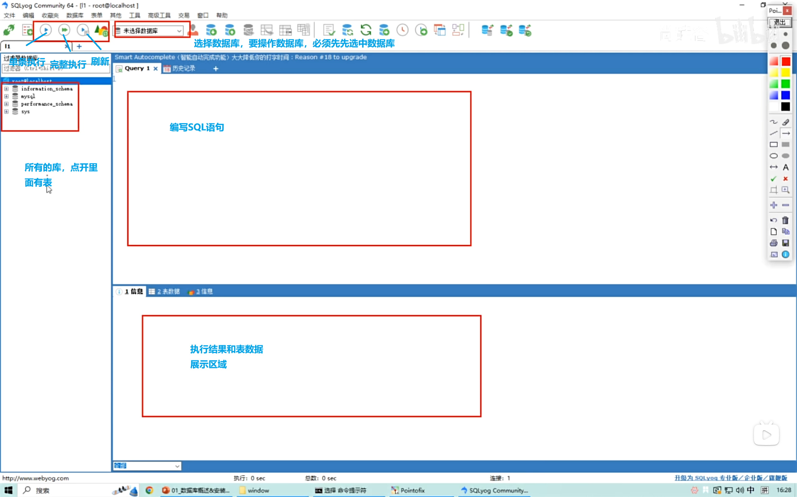

# 可视化工具介绍

黑窗口写SQL指令的缺点：

- 没有SQL提示
- 不能SQL备份
- 不方便黏贴指令
- 无法批量执行，只能一条一条执行
- 不能可视化等等

我们要换一个比命令窗口更好用的工具。

## 市面SQL可视化工具有很多，常用的有

MySQL Workbench: 它是MySQL官方提供 的工具，具有数据建模、 SQL开发、数据库管理 等多种功能。主要是 开 源免费，但是全英界 面！！

Navicat : 支持多种数据库系统， 包括MySQL 、 PostgreSQL 、Oracle 等。它提供了强大的图 形界面和数据同步功能 , 界面稍显复杂 ，免费版 功能阉割 ！

SQLyog : 是一个用于MySQL 数 据库的图形化管理工具， 提供了直观的用户界面 和强大的数据库管理功 能。界面相对简单， 免 费版功能阉割（没有代 码提示和补全能力） ！

