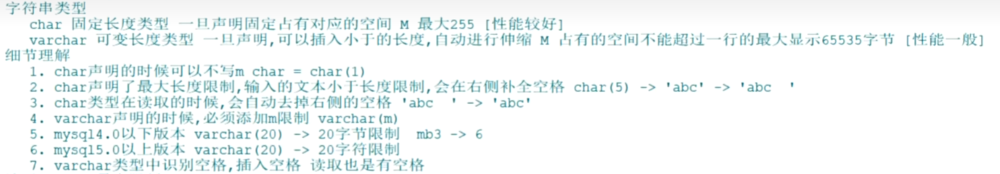
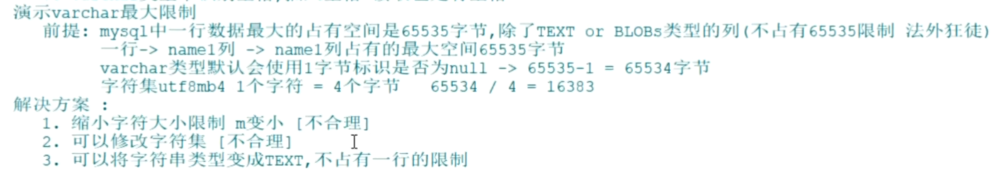

# 字符类型深思和总结

## 讨论M






示例1：

```sql
CREATE TABLE 表名 (
post_name VARCHAR(16384) NOT NULL
) ENGINE=INNODB CHARSET=utf8mb4;
错误代码： 1074
Column length too big for column 'post_name' (max = 16383); use BLOB or TEXT instead
```

前提：在MySQL的设定中，单行数据最大能存储65535字节数据（注意：是一行非额外存储所有列总和且单位是字节）

原因：

- 字符集为utf8mb4，每个字符占4个字节
- 字符串列需要1个额外字节空间记录是否为空
- 计算（65535-1）/ 4 = 16383.5 向下取余 16383，单列utf8mb4字符集类型最大字符限制16383


示例2：

```sql
CREATE TABLE 表名 (
post_name VARCHAR(16000) NOT NULL,
post_name2 VARCHAR(384) NOT NULL
) ENGINE=INNODB CHARSET=utf8mb4;
错误代码： 1118
Row size too large. The maximum row size for the used table type, not counting BLOBs, is 65535. This
includes storage overhead, check the manual. You have to change some columns to TEXT or BLOBs
```

解决：在MySQL的设定中，单行数据最大能存储65535字节数据，但是TEXT和BLOB类型不计算，他们属于额外存储！ 这种场景可以使用TEXT进行某列类型替换即可！

> 一行有多个列，所有列的存储大小的总和不能超过65535。

##  数据类型（文本类型）

在MySQL中，TEXT用来保存文本类型的字符串，总共包含4种类型，分别为TINYTEXT、TEXT、MEDIUMTEXT 和 LONGTEXT 类型。 在向TEXT类型的字段保存和查询数据时，系统自动按照实际长度存储，不需要预先定义长度。这一点和 VARCHAR类型相同。

| 文本字符串类型 | 特点               | 长度(字符) | 存储范围（字节）    | 占用的存储空间       |
| -------------- | ------------------ | ---------- | ------------------- | -------------------- |
| TINYTEXT       | 小文本、可变长度   | L          | `0 <= x <= 255`     | L + 2 个字节         |
| TEXT           | 文本、可变长度     | L          | `0 <= x <= 65535`   | L + 2 个字节         |
| MEDIUMTEXT     | 中等文本、可变长度 | L          | `0 <= x <= 65535`   | L + 3 个字节         |
| LONGTEXT       | 大文本、可变长度   | L          | `0<=x<= 4294967295` | L + 4 个字节(最大4g) |

```sql
CREATE TABLE 表名(
    tx TEXT
);
```

> 都是可变长度

开发经验： 

- 短文本，固定长度使用char 例如：性别，手机号 
- 短文本，非固定长度使用varchar 例如：姓名，地址 
- 大文本，建议存储到文本文件，使用varchar记录文件地址，不使用TEXT直接存储大文本，他性能非常较差！