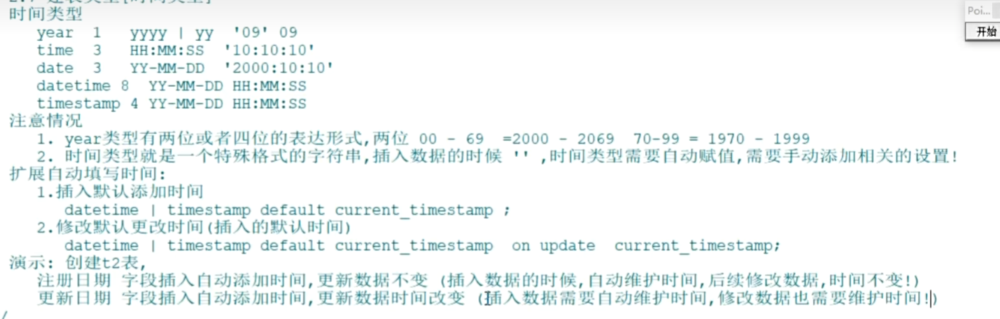

# 时间类型

用于表示时态值的日期和时间数据类型为 DATE 、TIME、DATETIME、TIMESTAMP 和 YEAR 。每种类型都有一个有效值范围，换一种思路， 可以理解时间类型就是`特殊格式的字符串`。

| 类型      | 名称     | 字节 | 日期格式            | 最小值              | 最大值              |
| --------- | -------- | ---- | ------------------- | ------------------- | ------------------- |
| YEAR      | 年       | 1    | YYYY或YY            | 1901                | 2155                |
| TIME      | 时间     | 3    | HH:MM:SS            | -838:59:59          | 838:59:59           |
| DATE      | 日期     | 3    | YYYY-MM-DD          | 1000-01-01          | 9999-12-03          |
| DATETIME  | 日期时间 | 8    | YYYY-MM-DD HH:MM:SS | 1000-01-01 00:00:00 | 9999-12-31 23:59:59 |
| TIMESTAMP | 日期时间 | 4    | YYYY-MM-DD HH:MM:SS | 1970-01-01 00:00:00 | 2038-01-19 03:14:07 |

注意：

- year类型赋00-99值对应年限，[00-69]对应[2000-2069],[70-99]对应[1970-1999],建议四位年值！ 

  > 时间就是特殊格式的字符串，不同类型的时间格式不同
  > year类型推荐用四位
  >
  > year类型可以用数字也可以用字符串表示，其他时间类型只能用 字符串表示

- 默认情况下，时间需要主动赋予默认值和修改值！

  > 需要主动进行相关设置

扩展：DATETIME和TIMESTAMP类型自动初始化和更新

```sql
# 方式1： 插入默认当前时间和修改自动更新当前时间
ts TIMESTAMP DEFAULT CURRENT_TIMESTAMP ON UPDATE CURRENT_TIMESTAMP,
dt DATETIME DEFAULT CURRENT_TIMESTAMP ON UPDATE CURRENT_TIMESTAMP
# 方式2： 插入默认当前时间
ts TIMESTAMP DEFAULT CURRENT_TIMESTAMP,
dt DATETIME DEFAULT CURRENT_TIMESTAMP
```



