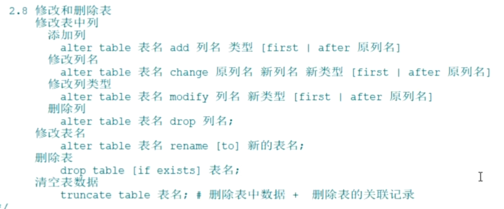

# 数据表修改和删除操作

## 修改表

修改表中列（字段）

```sql
# 修改表，添加一列[可以指定X字段前或者后]
ALTER TABLE 表名 ADD 字段名 字段类型 [FIRST|AFTER 字段名];
# 修改表，修改列名
ALTER TABLE 表名 CHANGE 原字段名 字段名 新字段类型 [FIRST|AFTER 字段名];
# 修改表，修改列类型
ALTER TABLE 表名 MODIFY 字段名 新字段类型 [FIRST|AFTER 字段名];
# 修改表，删除一列
ALTER TABLE 表名 DROP 字段名;
```

> FIRST|AFTER 指使用ALTER TABLE语句操作列之后，将其添加在原有表中的某一列的前或后

修改表名

```sql
# 修改表名
ALTER TABLE 表名 RENAME [TO] 新表名;
```

## 删除表

删除数据表

```sql
# 删除表
DROP TABLE [IF EXISTS] 数据表1 [, 数据表2, …, 数据表n];
```

> 删除会清空表和表结构

清空表数据

```sql
# 清空表数据
TRUNCATE TABLE 表名;
```

> 清空指清空表和与表相关联的数据，不删除表结构

注意: 删除表和清空表数据命令都是无法回滚的！动作不可以，执行之前需三思！


