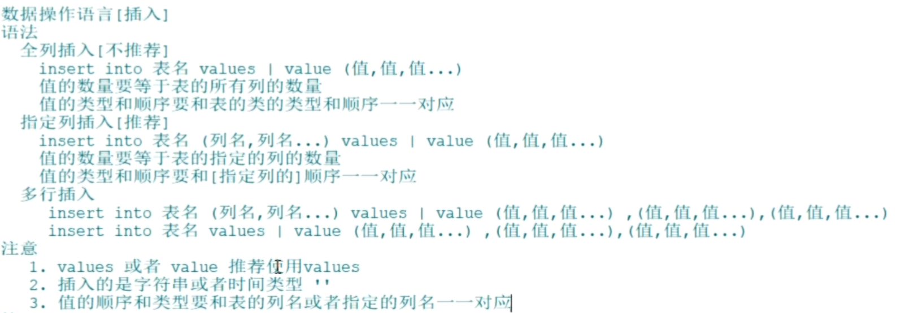

# 插入语法和插入实战练习

## 插入数据语法

情况1：为表的一行所有字段（列）插入数据

```sql
INSERT INTO 表名 VALUES (value1,value2,....);
```

值列表中需要为表的每一个字段指定值，并且值的顺序必须和数据表中字段定义时的顺序相同。


情况2：为表的一行指定字段（列）插入数据(推荐)

```sql
INSERT INTO 表名(列名1,列名2.....） VALUES (value1,value2,....);
```

值列表中需要为表名后指定的列指定值，并且值的顺序和类型必须和指定的列顺序相同。


情况3：同时插入多条记录

```sql
INSERT INTO 表名 VALUES (value1,value2,....) ,...., (value1,value2,....);
或者
INSERT INTO 表名(列名1,列名2.....) VALUES (value1,value2,....) ,...., (value1,value2,....);
```

情况1、情况2都可以转成一次插入多表数据，只需要在values后面写多个`(值1,值2…)`即可，`()`代表一行。

## 小结

- VALUES也可以写成VALUE，但是VALUES是标准写法。
- 字符和日期型数据应包含在单引号中。



## 插入数据实战

准备表结构

```sql
#创建数据库dml_d1
CREATE DATABASE IF NOT EXISTS dml_d1;
#指定使用数据库
USE dml_d1;
CREATE TABLE students (
    stu_id INT COMMENT '学号',
    stu_name VARCHAR(100) COMMENT '姓名',
    stu_age TINYINT UNSIGNED COMMENT '年龄',
    stu_birthday DATE COMMENT '生日',
    stu_height DECIMAL(4, 1) DEFAULT 200 COMMENT '身高，保留一位小数'
);
```

插入数据练习

1. 插入一名学生的所有信息，包括学号、名字、年龄、生日和身高。 

   ```sql
   INSERT INTO students VALUES (1,'张三',18,'1995-06-06',185.5);
   # 或者
   INSERT INTO students(stu_id,stu_name,stu_age,stu_birthday,stu_height) VALUES (1,'张三',18,'1995-06-06',185.5);
   ```

2. 插入一名学生的学号、名字、年龄，其他列使用默认值。 

   ```sql
   INSERT INTO students(stu_id,stu_name,stu_age) VALUES (2,'李四'，20）；
   ```

3. 插入两名学生的信息，包括学号、名字、年龄、生日和身高。 

   ```sql
   INSERT INTO students VALUES (4,'王五',20,'2020-02-22',158.8),(5,'赵六',20,'2070-02-22',198.8)；
   ```

4. 插入一名学生的信息，只提供学号、名字和年龄，其他列为空值。

   ```sql
   INSERT INTO students(stu_id,stu_name,stu_age,stu_birthday,stu_height) VALUES (6,'王麻子'，20，NULL,NULL）；
   ```

   